# Canasu Dream Foundation

- A time-frame of 24 hours was given to us, our dedicated team of 7 members collaborated to bring this impactful website to life.
- With a strong focus on women empowerment, the website serves as a beacon of hope, connecting passionate volunteers with the opportunity to upskill and support women on their journey to success.
- Emphasizing user-friendly design and seamless navigation, the website provides a space for volunteers to join forces with the organization, fostering a community of positive change-makers. Together, we aim to uplift women and drive sustainable progress.

 

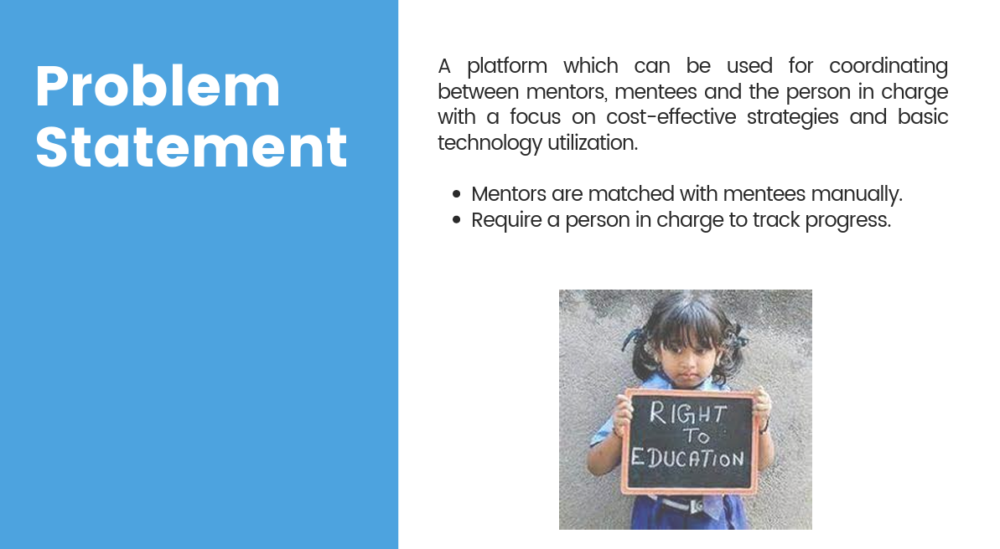

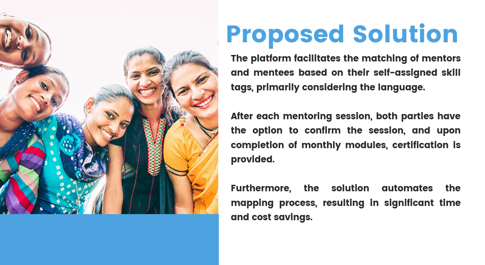

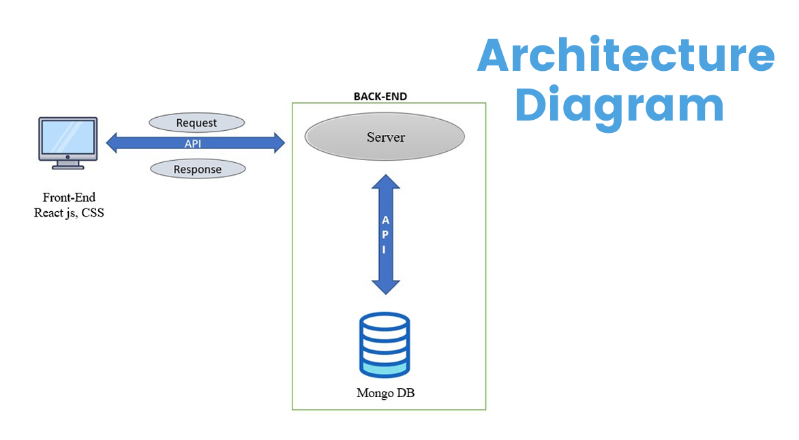

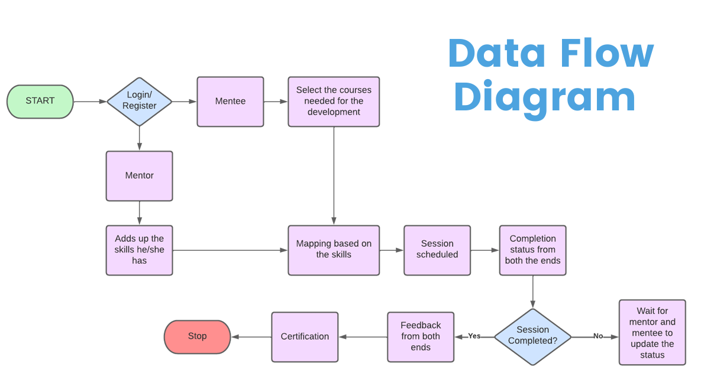

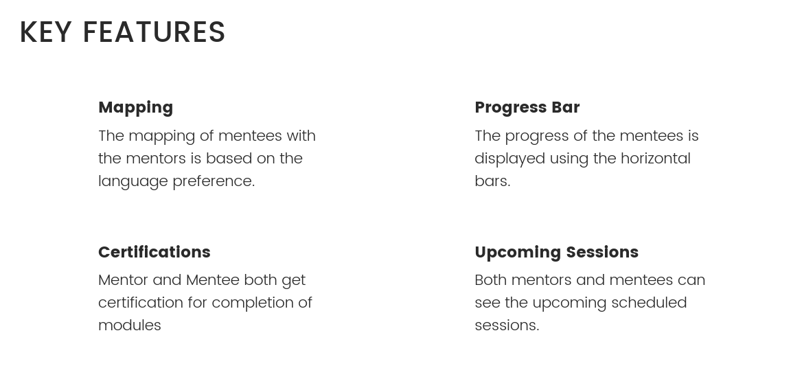

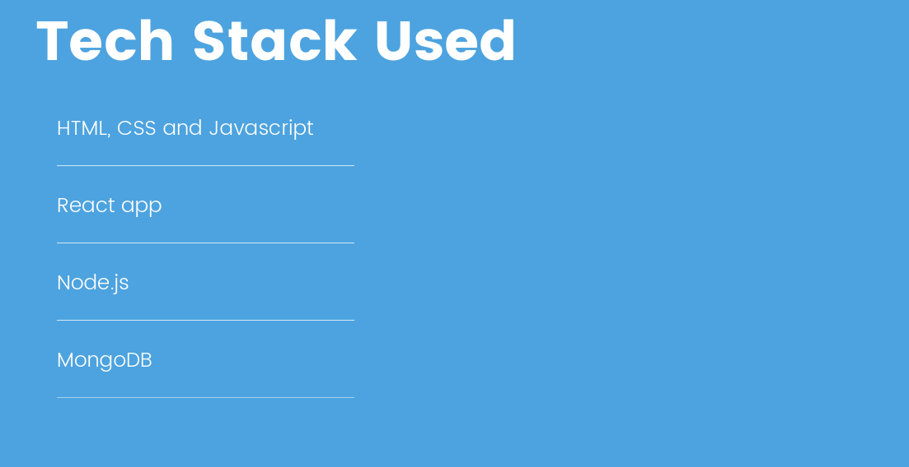

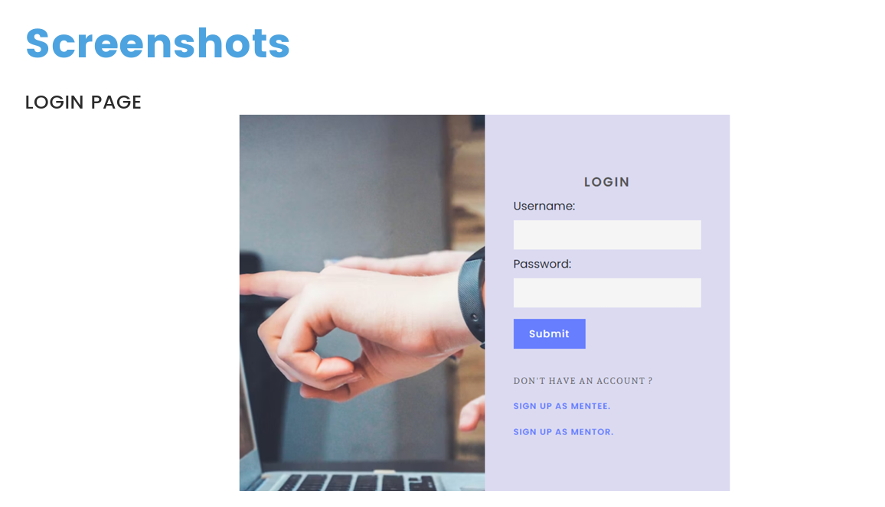

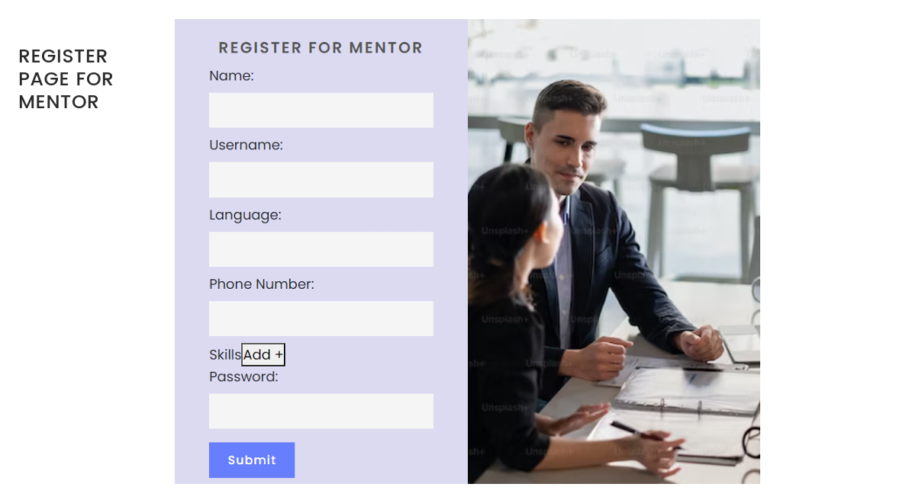

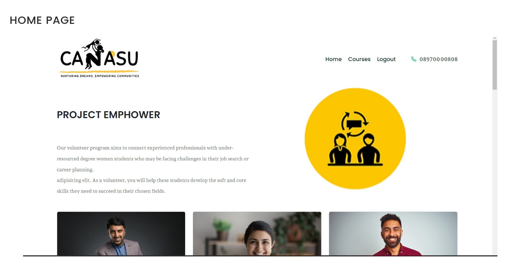

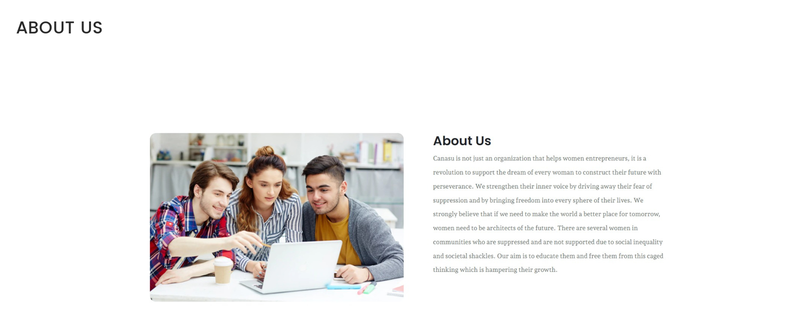

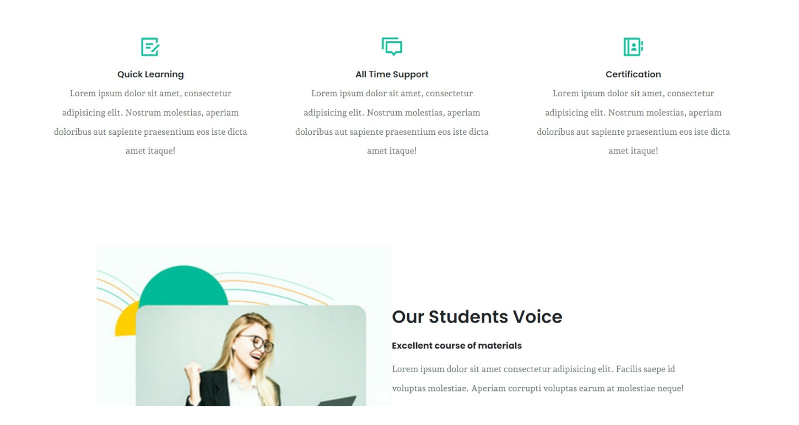

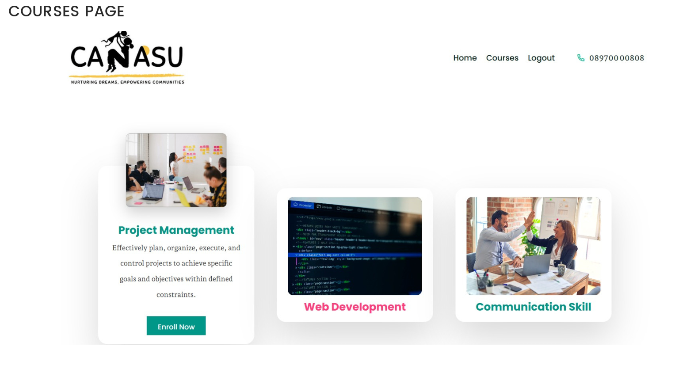

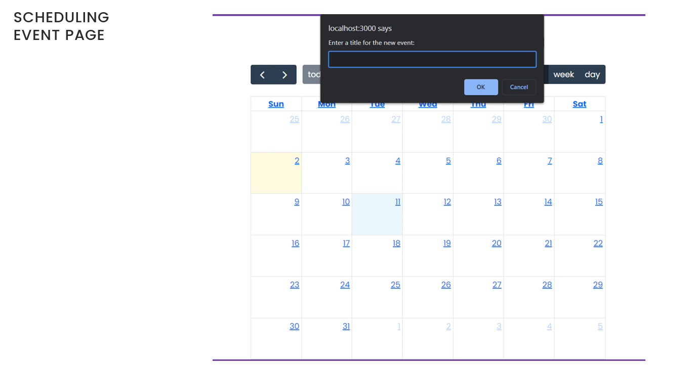

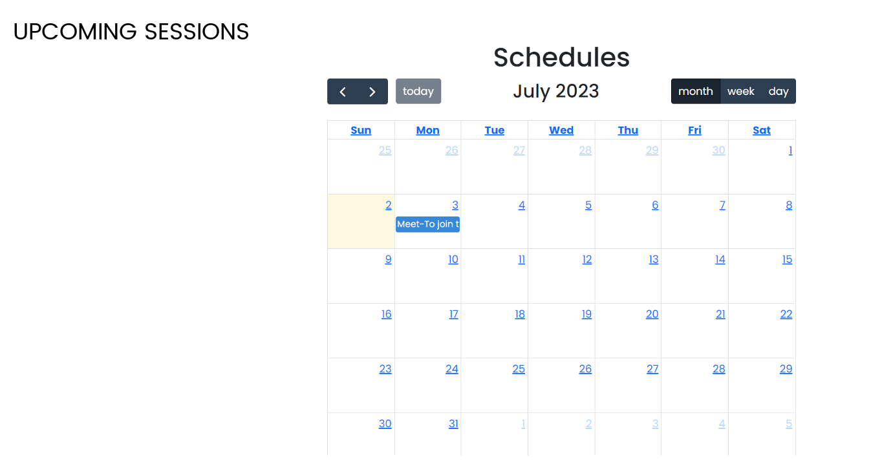

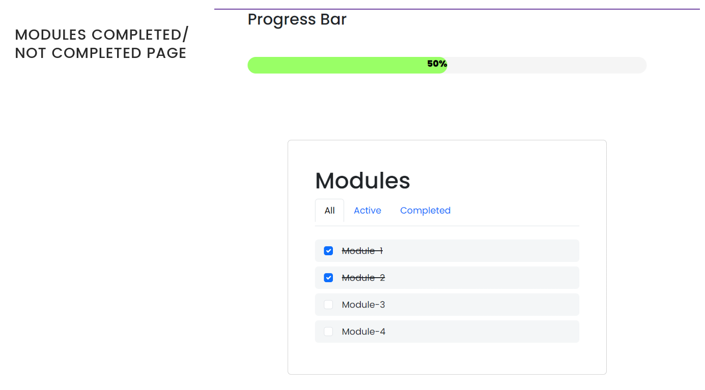

